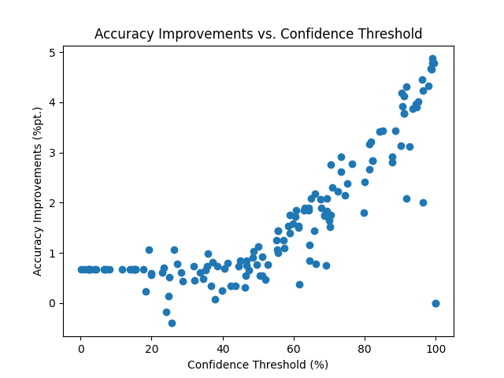
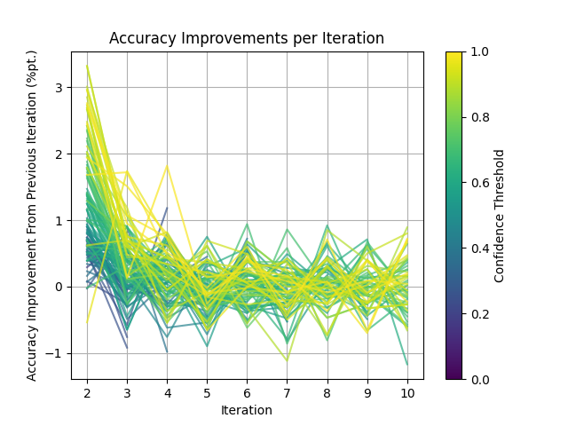

# Self-Training

This repository implements an iterative pseudo-labeling experiment: A CNN is trained on a small initial subset of the MNIST dataset, say 1000 samples instead of the full 60000. The model then predics the labels of the remaining 59000 samples. Those data points for which the model has a high enough confidence, say above 95 %, are added to the training dataset with the predicted (as opposed to the true) labels. This process is then repeated, measuring the model's quality on the test dataset on each iteration.

## Getting Started

### Installation

Install [Poetry](https://python-poetry.org/) and then install the required packages by running `poetry install`.

There is no need to download any data as that is done automatically when you run the experiment for the first time.

### Running the Experiment

Execute `poetry run python scripts/run_experiment.py` to run one experiment. To repeatedly run experiments with random confidence thresholds, run `poetry run python scripts/run_multiple_experiments.py`.

These scripts save their results to ./output. The results may then be plotted by the functions in `self_training.plot`, see scripts/plot_all.py.

